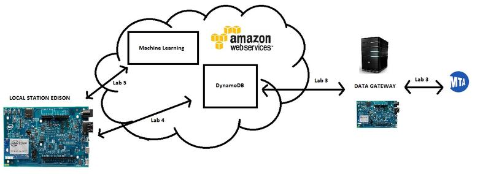
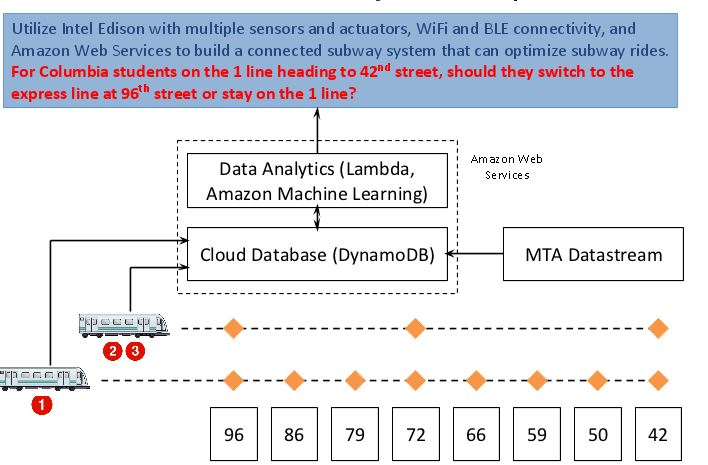

# iot - Intelligent Metro Transfer System

(AWS Cognito, DynamoDB, Kinesis, S3, Machine Learning, Lambda, SNS, Intel Edison)

- Acquired real-time MTA Data stream of the arrival and departure times of each subway at each station from NYC MTA

- Completed data clean for huge volume of history records stored in AWS DynamoDB

- Created the ML model to make real time transfer planning using data from Kinesis stream

The purpose of this project is to become familiar with the full IoT stack, which comprises of a hardware and a cloud layer. This project will utilize the Intel Edison with multiple sensors and actuators, WiFi and BLE connectivity, and Amazon Web Services to build a connected subway system that can optimize subway rides. 

We will utilize this connected subway system to address a common question many Columbia students face when they are taking the subway downtown from the 116th Street red line: For Columbia students on the 1 line heading to 42nd street, should they switch to the express line at 96th street or stay on the 1 line? 

This connected subway system will be built over three labs. The major sub-modules of this system include: 
- Hardware platform Installed in Each Subway (Local Station Gateway) - This hardware platform consists of an Intel Edison board, along with a range of sensors and actuators. The Intel Edison board also provides WiFi and Bluetooth Low Energy (BLE) connectivity, which allows the sensor data streams to be sent over to a cloud database for storage and data analytics. 
- Cloud Database – The cloud database can store a multitude of data streams. There are many cloud database services available, including Facebook Parse, Google Firebase, Microsoft Azure, and IBM Bluemix. For this course, we will be using Amazon Web Services (AWS). A comparison of these different cloud platform is reviewed in class.
- Data Analytics Engine – A major advantage of storing the large amount of data streams on the cloud is that they can be fed into a data analytics engine or machine learning software. AWS has their own suite of machine learning tools that we can leverage to build a real-time prediction engine to determine whether or not a subway rider should switch to the express line at 96th street or stay on the 1 line.
- Open-Source MTA Data Stream – The NYC MTA provides real-time data of the arrival and departure times of each subway at each station. This information is streamed to our AWS cloud to be used in conjunction with the local sensor data on each subway to build our real-time subway arrival prediction engine.